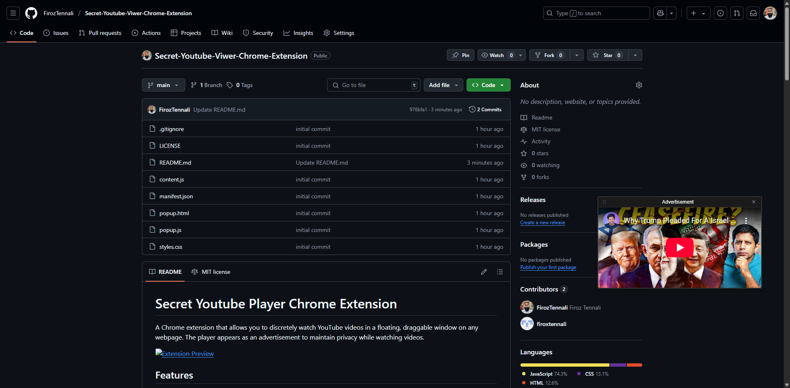

# Secret Youtube Player Chrome Extension

A Chrome extension that allows you to discretely watch YouTube videos in a floating, draggable window on any webpage. The player appears as an advertisement to maintain privacy while watching videos.



## Features

- **Discrete Viewing**: Videos appear in a floating window that looks like a regular advertisement
- **Draggable Window**: Click and drag the top bar to move the player anywhere on the screen
- **Resizable Player**: Grab the bottom-right corner to resize the window
- **Keyboard Shortcuts**:
  - `Ctrl + Shift + Z`: Show/Hide the player (keeps playing)
  - `Ctrl + Shift + X`: Close the player (stops playback)
  - `Ctrl + Shift + Space`: Play/Pause video
- **Close Button**: Quick close button in the top-right corner
- **Stays Within Screen**: Player automatically stays within viewport boundaries
- **Maintains Aspect Ratio**: Videos maintain their aspect ratio while resizing

## Installation

### From Source
1. Clone this repository:
   ```bash
   git clone https://github.com/yourusername/advertisement-player.git
   ```
2. Open Chrome and navigate to `chrome://extensions/`
3. Enable "Developer mode" in the top-right corner
4. Click "Load unpacked" and select the extension directory

### Usage

1. Find a YouTube video you want to watch
2. Click the "Share" button below the video
3. Click "Embed" to get the embed code
4. Click the extension icon in your Chrome toolbar
5. Paste the embed code into the text area
6. Click "Embed Video" or press Enter

The video will appear in a draggable window that looks like an advertisement.

### Controls

- **Moving the Player**:
  - Click and drag the top bar to move the window
  - The player will stay within screen boundaries

- **Resizing**:
  - Grab the bottom-right corner to resize
  - The player maintains minimum dimensions
  - Aspect ratio is preserved

- **Keyboard Controls**:
  - Use `Ctrl + Shift + Z` to quickly hide/show the player
  - Use `Ctrl + Shift + X` to close the player completely
  - Use `Ctrl + Shift + Space` to play/pause the video

## Project Structure

```
advertisement-player/
├── manifest.json        # Extension configuration
├── popup.html          # Extension popup interface
├── popup.js            # Popup functionality
├── content.js          # Main player functionality
├── styles.css          # Player styling
└── README.md          # Documentation
```

## Technical Details

- Uses Chrome Extension Manifest V3
- Implements the YouTube Player API
- Uses DOM manipulation for player creation
- Handles keyboard events globally
- Manages iframe interactions safely
- Implements drag-and-drop without libraries

## Browser Compatibility

- Chrome: 88+
- Edge (Chromium): 88+
- Opera: 74+

## Privacy Features

- No data collection
- No external dependencies
- Works entirely client-side
- No analytics or tracking
- Videos load directly from YouTube

## Development

### Building from Source

1. Clone the repository
2. Make your modifications
3. Test in Chrome by loading as an unpacked extension
4. Create a pull request with your changes

### Contributing

1. Fork the repository
2. Create a feature branch
3. Commit your changes
4. Push to the branch
5. Create a Pull Request

## License

This project is licensed under the MIT License - see the [LICENSE](LICENSE) file for details.

## Acknowledgments

- YouTube Embed API
- Chrome Extensions API
- Contributors and testers

## Support

For support, please:
1. Check existing issues in the repository
2. Create a new issue with detailed information
3. Include steps to reproduce any problems

## Security

- The extension requests minimal permissions
- Code is open source and reviewable
- No external scripts are loaded
- Content is loaded only from YouTube

## Future Plans

- [ ] Add support for other video platforms
- [ ] Implement custom themes
- [ ] Add position memory
- [ ] Create size presets
- [ ] Add more keyboard shortcuts

## Changelog

### Version 1.0
- Initial release
- Basic player functionality
- Keyboard shortcuts
- Draggable window
- Resizable player 
